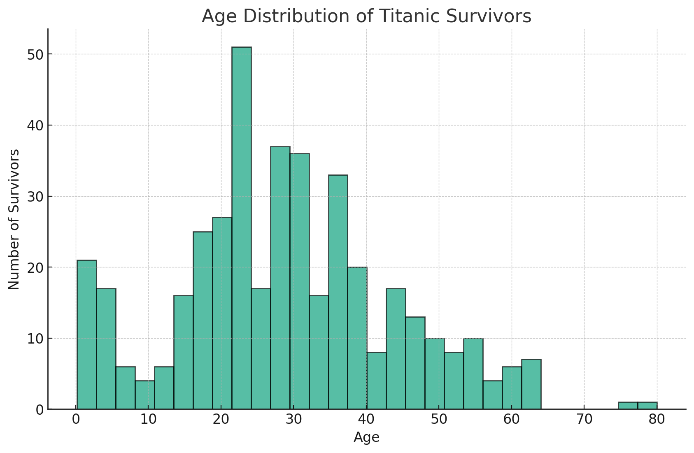
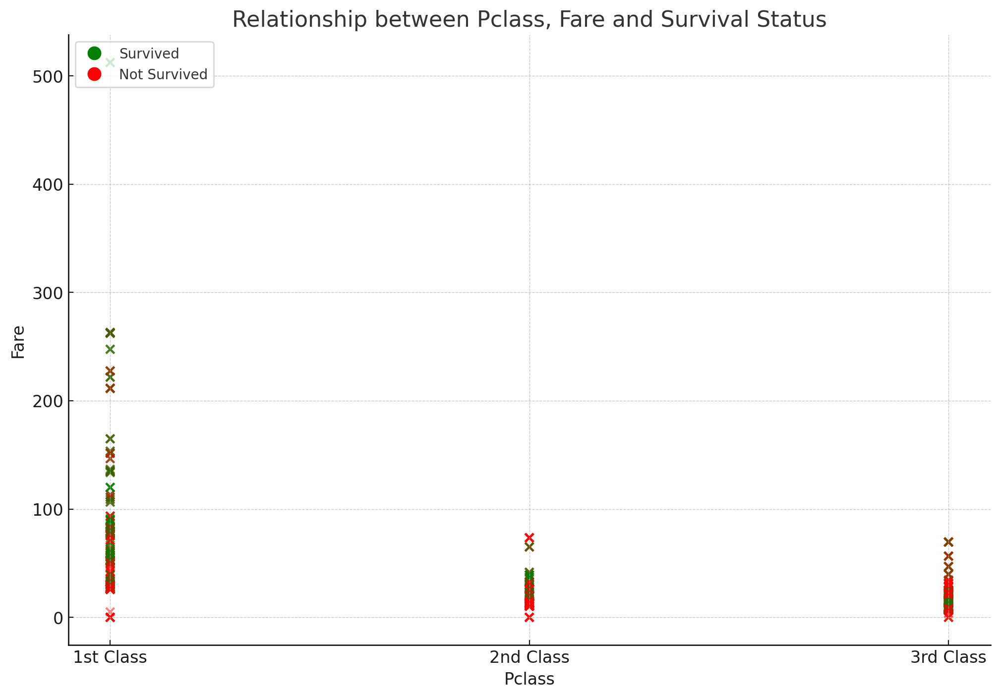
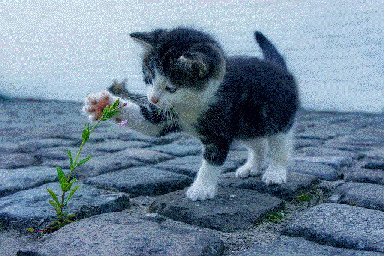
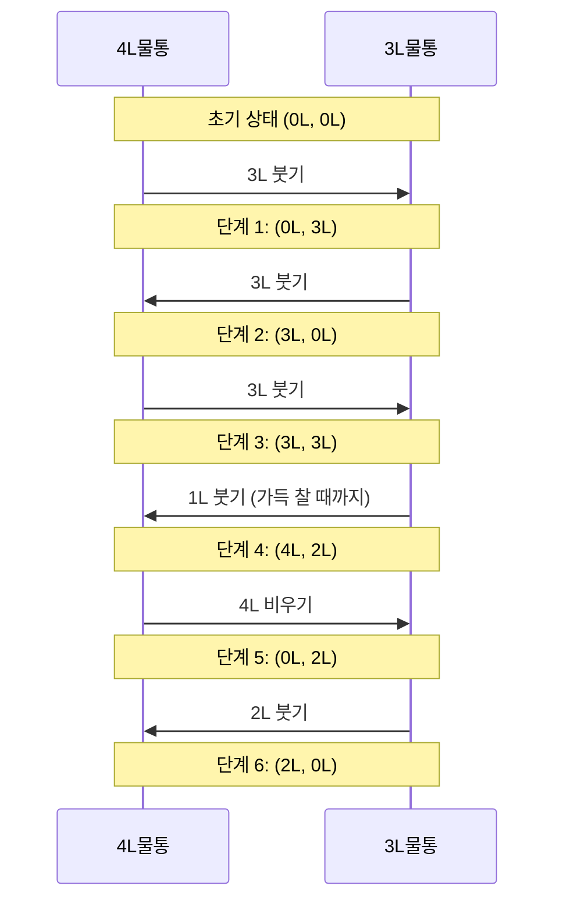

# chatGPT 챗봇 수업
## 1차과제 
[chatGPT 링크](https://chat.openai.com/share/222fcab0-b140-4f57-886f-8e593fff0649)
### 1. ADA 프롬프트 3가지 
1_1. 주어진 파일에서 생존자의 나이(Age)에 따른 추이를 차트로 표현해줘


<details>
  <summary>답변</summary>
먼저, 주어진 파일을 확인하고 데이터를 로드하겠습니다.
  
```python
import pandas as pd

# Load the data from the provided CSV file

titanic_data = pd.read_csv("‪titanic.csv")
titanic_data.head()
```
```
RESULT
   PassengerId  Survived  Pclass  \
0            1         0       3   
1            2         1       1   
2            3         1       3   
3            4         1       1   
4            5         0       3   

                                                Name     Sex   Age  SibSp  \
0                            Braund, Mr. Owen Harris    male  22.0      1   
1  Cumings, Mrs. John Bradley (Florence Briggs Th...  female  38.0      1   
2                             Heikkinen, Miss. Laina  female  26.0      0   
3       Futrelle, Mrs. Jacques Heath (Lily May Peel)  female  35.0      1   
4                           Allen, Mr. William Henry    male  35.0      0   

   Parch            Ticket     Fare Cabin Embarked  
0      0         A/5 21171   7.2500   NaN        S  
1      0          PC 17599  71.2833   C85        C  
2      0  STON/O2. 3101282   7.9250   NaN        S  
3      0            113803  53.1000  C123        S  
4      0            373450   8.0500   NaN        S  
```


데이터가 로드되었습니다. 

생존자의 나이에 따른 추이를 차트로 표현하기 위해 다음과 같은 단계를 진행하겠습니다:

1. 생존자 데이터만 필터링합니다.
2. 나이에 따라 데이터를 정렬하고 분포를 차트로 표현합니다.

이제 차트를 작성하겠습니다.

```python
import matplotlib.pyplot as plt

# Filter the data for survivors only
survivors_data = titanic_data[titanic_data["Survived"] == 1]

# Plotting the age distribution of survivors
plt.figure(figsize=(10, 6))
plt.hist(survivors_data["Age"].dropna(), bins=30, edgecolor="k", alpha=0.7)
plt.title("Age Distribution of Titanic Survivors")
plt.xlabel("Age")
plt.ylabel("Number of Survivors")
plt.grid(True, which="both", linestyle="--", linewidth=0.5)
plt.show()
```



여기서 보시는 바와 같이, 타이타닉의 생존자들의 나이 분포 차트입니다. 

차트를 분석해보면, 20대 초반의 생존자 수가 가장 많았음을 알 수 있습니다. 그리고 아이들(10세 미만)의 생존률도 상대적으로 높은 편입니다. 이외에도 다양한 연령대에서의 생존자들이 분포되어 있음을 확인할 수 있습니다.
</details>

1_2. 객실 등급(Pclass)과 요금(Fare)에 따른 생존자의 상관 관계를 차트로 표현해주세요

<details>
  <summary>답변</summary>
객실 등급(Pclass)과 요금(Fare)에 따른 생존자의 상관 관계를 시각화하기 위해, 산점도(scatter plot)를 사용하겠습니다. 이를 통해 각 객실 등급에서의 요금 분포와 그에 따른 생존 여부를 한눈에 파악할 수 있습니다.

산점도에는 다음과 같은 정보를 포함시키겠습니다:

1. x축: 객실 등급(Pclass)
2. y축: 요금(Fare)
3. 점의 색상: 생존 여부 (생존: 녹색, 사망: 빨간색)

이제 해당 차트를 작성하겠습니다.
```python
# Plotting the relationship between Pclass, Fare and Survival status
plt.figure(figsize=(12, 8))
colors = {0: "red", 1: "green"}

# Scatter plot
plt.scatter(titanic_data["Pclass"], titanic_data["Fare"], c=titanic_data["Survived"].apply(lambda x: colors[x]), alpha=0.5)

# Title and labels
plt.title("Relationship between Pclass, Fare and Survival Status")
plt.xlabel("Pclass")
plt.ylabel("Fare")
plt.xticks([1, 2, 3], ["1st Class", "2nd Class", "3rd Class"])
plt.grid(True, which="both", linestyle="--", linewidth=0.5)

# Legend
from matplotlib.lines import Line2D
legend_elements = [Line2D([0], [0], marker='o', color='w', markerfacecolor='green', markersize=10, label='Survived'),
                   Line2D([0], [0], marker='o', color='w', markerfacecolor='red', markersize=10, label='Not Survived')]
plt.legend(handles=legend_elements, loc="upper left")

plt.show()
```


차트에서 다음과 같은 관찰을 할 수 있습니다:

1. **1등급 객실**: 높은 요금을 지불한 승객들이 주로 이 객실에 있습니다. 생존자의 비율이 상대적으로 높은 것으로 보입니다.
2. **2등급과 3등급 객실**: 요금의 분포가 낮습니다. 특히 3등급 객실은 많은 승객들이 낮은 요금을 지불했으며, 생존자의 비율이 낮은 것으로 보입니다.

요약하면, 높은 요금을 지불한 승객들, 특히 1등급 객실의 승객들은 생존 확률이 더 높았던 것으로 판단됩니다.
</details>


*이미지 Zoom In/Out 효과 만들기


1_3. 위에 이미지에 마우스 포인터가 닿으면 줌 닿지 않으면 줌아웃되는 gif 파일로 만들어 줘.

<details>
  <summary>답변</summary>
마우스 포인터가 이미지에 닿았을 때 줌되고, 닿지 않았을 때 줌아웃되는 GIF 파일을 만들기 위해서, 다음과 같은 절차를 따르겠습니다:

1. 원본 이미지를 로드합니다.
2. 줌된 이미지 버전을 생성합니다.
3. 두 이미지를 번갈아가며 표시하는 GIF를 생성합니다.

먼저, 원본 이미지를 로드하고 줌된 이미지 버전을 생성하겠습니다.

```python
from PIL import Image

# Load the image
img = Image.open("/mnt/data/cat-2536662_640.jpg")

# Create a zoomed version of the image
zoom_factor = 1.2
width, height = img.size
zoomed_img = img.crop((
    width * (1 - zoom_factor) / 2,
    height * (1 - zoom_factor) / 2,
    width * (1 + zoom_factor) / 2,
    height * (1 + zoom_factor) / 2
)).resize((width, height), Image.ANTIALIAS)

img, zoomed_img
```

```RESULT
RESULT
(<PIL.JpegImagePlugin.JpegImageFile image mode=RGB size=640x426 at 0x7EA1441A1A30>,
 <PIL.Image.Image image mode=RGB size=640x426 at 0x7EA14410AD90>)
```

원본 이미지와 줌된 이미지 버전을 성공적으로 생성했습니다. 

이제 두 이미지를 번갈아 가며 표시하는 GIF를 생성하겠습니다.
```python
from PIL import ImageSequence

# Create a GIF with the two images
gif_path = "/mnt/data/zoom_effect.gif"
img.save(
    gif_path,
    append_images=[zoomed_img],
    save_all=True,
    duration=[1000, 1000],  # Show each image for 1 second
    loop=0  # Loop indefinitely
)

gif_path
```

```RESULT
'/mnt/data/zoom_effect.gif'
```

GIF 파일이 성공적으로 생성되었습니다!



다음 [링크](sandbox:/mnt/data/zoom_effect.gif)를 클릭하여 GIF 파일을 다운로드하실 수 있습니다: [zoom_effect.gif 다운로드](sandbox:/mnt/data/zoom_effect.gif)

</details>

1_4. 화면에 이미지를 표시하고 마우스 포인터가 닿았을 때 확대시켜 주고 마우스 포인터가 닿지 않으면 축소시키는 이미지를 보여줘

<details>
  <summary>답변</summary>
죄송합니다. 이 환경에서 마우스 포인터 이벤트에 따라 이미지를 동적으로 확대/축소하는 기능을 직접 구현하고 표시하는 것은 지원하지 않습니다.

하지만 HTML, CSS, JavaScript를 사용하여 웹 페이지에서 이러한 기능을 구현하는 것은 가능합니다. 필요하시다면 해당 코드를 제공해드릴 수 있습니다.

추가질문 : 코드를 제공해줘

물론이죠! 

아래는 HTML, CSS, 그리고 JavaScript를 사용하여 마우스 포인터가 이미지에 닿았을 때 이미지를 확대하고, 마우스 포인터가 이미지에서 벗어났을 때 이미지를 원래 크기로 되돌리는 기능을 구현한 코드입니다:

```html
<!DOCTYPE html>
<html lang="en">
<head>
    <meta charset="UTF-8">
    <meta name="viewport" content="width=device-width, initial-scale=1.0">
    <title>Image Zoom on Hover</title>
    <style>
        #zoomable-image {
            transition: transform 0.3s ease;
            width: 300px;
        }

        #image-container:hover #zoomable-image {
            transform: scale(1.2);
        }
    </style>
</head>
<body>
    <div id="image-container">
        
    </div>

    <script>
        const imageContainer = document.getElementById("image-container");
        const zoomableImage = document.getElementById("zoomable-image");

        imageContainer.addEventListener("mouseover", () => {
            zoomableImage.style.transform = "scale(1.2)";
        });

        imageContainer.addEventListener("mouseout", () => {
            zoomableImage.style.transform = "scale(1)";
        });
    </script>
</body>
</html>
```

위 코드에서 `path_to_your_image.jpg`를 원하는 이미지 경로로 교체하세요. 

이 코드는 이미지에 마우스 포인터를 올리면 이미지가 확대되고, 마우스 포인터가 이미지 밖으로 나가면 이미지가 원래 크기로 돌아오게 됩니다. CSS의 `transition` 속성을 사용하여 확대/축소 효과에 부드러운 애니메이션을 적용했습니다.


</details>

1_5. # role: python </br># rule: 물통에 물을 가득 채운다. 물통의 물을 전부 다 비운다. 물통에 남은 물을 다른 물통에다 붓는다. 물통의 물을 다른 물통이 가득 찰 때까지 붓는다.

4리터들이 물통과 3리터들이 물통이 각각 하나씩 있는데, 이 물통들에는 용량을 나타내는 어떤 표시도 없다. 이와 같이 눈금이 없는 조건에서 4리터들이 물통에다 꼭 2리터의 물을 채우는 방법을 구해 보시오.

<details>
  <summary>답변</summary>

```python
def measure_water():
    # Initialize the bottles
    four_liter_bottle = 0
    three_liter_bottle = 0

    # Fill the 3-liter bottle to the top
    three_liter_bottle = 3

    # Pour water from the 3-liter bottle into the 4-liter bottle
    four_liter_bottle += three_liter_bottle
    three_liter_bottle = 0

    # Fill the 3-liter bottle to the top again
    three_liter_bottle = 3

    # Pour water from the 3-liter bottle into the 4-liter bottle until it's full
    remaining_space_in_4_liter = 4 - four_liter_bottle
    four_liter_bottle = 4
    three_liter_bottle -= remaining_space_in_4_liter

    return four_liter_bottle, three_liter_bottle

four_liter, three_liter = measure_water()
four_liter, three_liter
```

죄송합니다. 코드 실행 도중에 문제가 발생한 것 같습니다. 다시 시도하겠습니다.

물통 문제를 다시 풀어보겠습니다.

```python
def measure_water():
    steps = []

    # Initial state
    four_liter_bottle = 0
    three_liter_bottle = 0

    # Step 1: Fill the 3-liter bottle to the top
    three_liter_bottle = 3
    steps.append(("Fill 3L bottle", four_liter_bottle, three_liter_bottle))

    # Step 2: Pour water from the 3-liter bottle into the 4-liter bottle
    four_liter_bottle += three_liter_bottle
    three_liter_bottle = 0
    steps.append(("Pour 3L bottle into 4L bottle", four_liter_bottle, three_liter_bottle))

    # Step 3: Fill the 3-liter bottle to the top again
    three_liter_bottle = 3
    steps.append(("Fill 3L bottle again", four_liter_bottle, three_liter_bottle))

    # Step 4: Pour water from the 3-liter bottle into the 4-liter bottle until it's full
    remaining_space_in_4_liter = 4 - four_liter_bottle
    four_liter_bottle = 4
    three_liter_bottle -= remaining_space_in_4_liter
    steps.append(("Pour 3L bottle into 4L bottle until 4L is full", four_liter_bottle, three_liter_bottle))

    return steps

steps = measure_water()
steps
```

```RESULT
[('Fill 3L bottle', 0, 3),
 ('Pour 3L bottle into 4L bottle', 3, 0),
 ('Fill 3L bottle again', 3, 3),
 ('Pour 3L bottle into 4L bottle until 4L is full', 4, 2)]
```

위의 절차에 따라 4리터 물통에 정확히 2리터의 물을 채울 수 있습니다. 다음은 각 단계별 설명입니다:

1. 3리터 물통을 가득 채운다. (0L, 3L)
2. 3리터 물통의 물을 4리터 물통에 붓는다. (3L, 0L)
3. 3리터 물통을 다시 가득 채운다. (3L, 3L)
4. 3리터 물통의 물을 4리터 물통에 붓는다. 이 때, 4리터 물통은 3리터만 채워져 있으므로 1리터만 추가로 받을 수 있다. 결과적으로 3리터 물통에는 2리터의 물이 남게 된다. (4L, 2L)

따라서, 4리터 물통에는 4리터의 물이 가득 차 있고, 3리터 물통에는 2리터의 물이 남게 됩니다.
</details>

1_5_1. 위에 문제에서 4리터 물통에 2리터의 물을 채워달라고 했어. 문제를 다시 풀어줘.

<details>
  <summary>답변</summary>
죄송합니다. 제가 잘못 이해했네요. 다시 문제를 풀어보겠습니다.

4리터 물통에 2리터의 물을 채우기 위한 절차를 계산하겠습니다.

문제를 다시 풀어보겠습니다.

1. 3리터 물통을 가득 채운다. (4L: 0L, 3L: 3L)
2. 3리터 물통의 물을 4리터 물통에 붓는다. (4L: 3L, 3L: 0L)
3. 3리터 물통을 다시 가득 채운다. (4L: 3L, 3L: 3L)
4. 3리터 물통의 물을 4리터 물통에 붓는다. 이 때, 4리터 물통은 이미 3리터만큼 차 있으므로 1리터만 추가로 받을 수 있다. 따라서, 3리터 물통에서 1리터를 4리터 물통에 부어 4리터 물통을 가득 채우고, 3리터 물통에는 2리터의 물이 남게 된다. (4L: 4L, 3L: 2L)
5. 4리터 물통의 물을 전부 비운다. (4L: 0L, 3L: 2L)
6. 3리터 물통에 남아있는 2리터의 물을 4리터 물통에 붓는다. (4L: 2L, 3L: 0L)

결과적으로, 4리터 물통에는 2리터의 물이 정확히 채워지게 됩니다.

주어진 그래프를 mermaid를 사용한 시퀀스 다이어그램으로 변환하겠습니다. 물통의 변화 단계를 각각의 참여자로 표현하며, 물을 이동시키는 액션을 화살표로 나타냅니다.



이 코드를 mermaid 라이브러리가 포함된 페이지나 [Mermaid Live Editor](https://mermaid-js.github.io/mermaid-live-editor/)에 삽입하면 시퀀스 다이어그램이 시각화됩니다.
  
</details>

