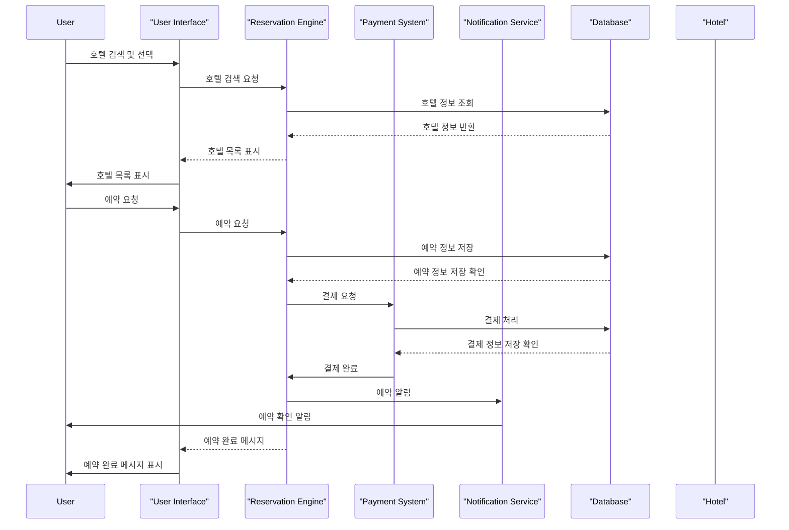
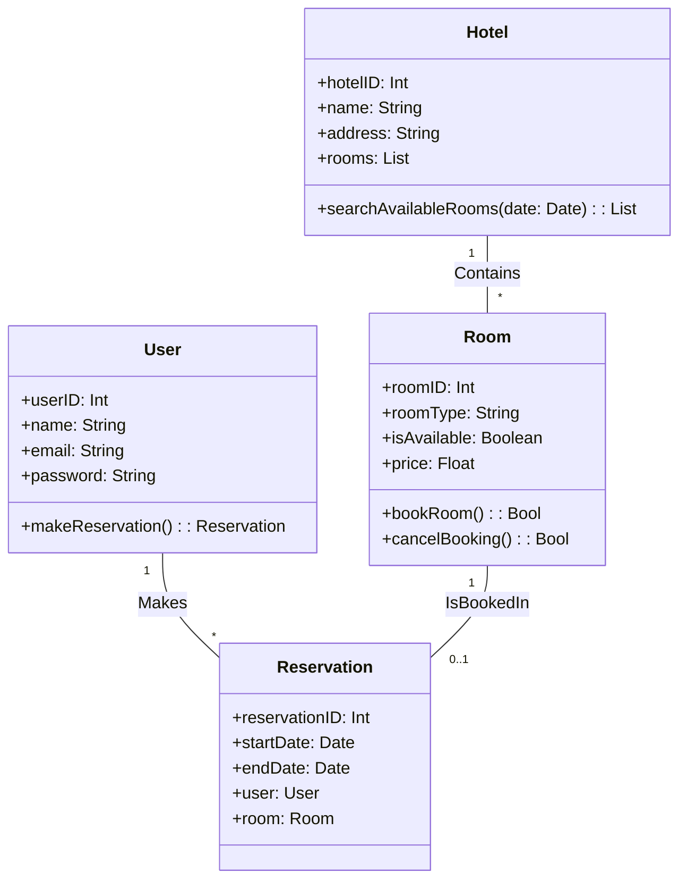
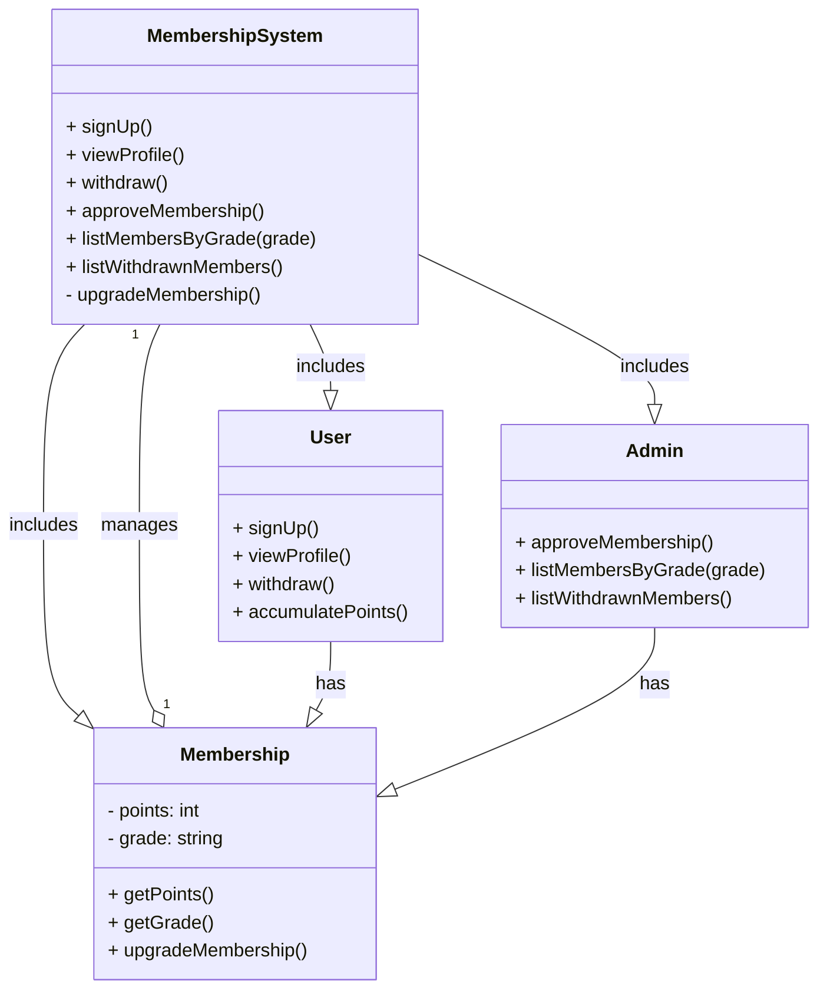

# chatGPT
## test1 : 시퀀시 다이어그램(호텔 예약 프로세스)

```mermaid
sequenceDiagram
    participant User
    participant UI as "User Interface"
    participant ReservationEngine as "Reservation Engine"
    participant PaymentSystem as "Payment System"
    participant NotificationService as "Notification Service"
    participant Database as "Database"
    participant Hotel as "Hotel"
    
    User->>UI: 호텔 검색 및 선택
    UI->>ReservationEngine: 호텔 검색 요청
    ReservationEngine->>Database: 호텔 정보 조회
    Database-->>ReservationEngine: 호텔 정보 반환
    ReservationEngine-->>UI: 호텔 목록 표시
    UI->>User: 호텔 목록 표시
    
    User->>UI: 예약 요청
    UI->>ReservationEngine: 예약 요청
    ReservationEngine->>Database: 예약 정보 저장
    Database-->>ReservationEngine: 예약 정보 저장 확인
    ReservationEngine->>PaymentSystem: 결제 요청
    PaymentSystem->>Database: 결제 처리
    Database-->>PaymentSystem: 결제 정보 저장 확인
    PaymentSystem->>ReservationEngine: 결제 완료
    ReservationEngine->>NotificationService: 예약 알림
    NotificationService->>User: 예약 확인 알림
    ReservationEngine-->>UI: 예약 완료 메시지
    UI->>User: 예약 완료 메시지 표시


```

## test2 : 클래스 다이어그램(호텔 예약 시스템 클래스 구조)

```mermaid
classDiagram
    User "1" -- "*" Reservation : Makes
    Room "1" -- "0..1" Reservation : IsBookedIn
    Hotel "1" -- "*" Room : Contains
    
    class User {
        +userID: Int
        +name: String
        +email: String
        +password: String
        +makeReservation(): Reservation
    }
    
    class Room {
        +roomID: Int
        +roomType: String
        +isAvailable: Boolean
        +price: Float
        +bookRoom(): Bool
        +cancelBooking(): Bool
    }
    
    class Reservation {
        +reservationID: Int
        +startDate: Date
        +endDate: Date
        +user: User
        +room: Room
    }
    
    class Hotel {
        +hotelID: Int
        +name: String
        +address: String
        +rooms: List<Room>
        +searchAvailableRooms(date: Date): List<Room>
    }


```

## test3 : 오류 체크 테스트

```mermaid
classDiagram
  class MembershipSystem {
    + signUp()
    + viewProfile()
    + withdraw()
    + approveMembership()
    + listMembersByGrade(grade)
    + listWithdrawnMembers()
    - upgradeMembership()
  }

  class User {
    + signUp()
    + viewProfile()
    + withdraw()
    + accumulatePoints()
  }

  class Admin {
    + approveMembership()
    + listMembersByGrade(grade)
    + listWithdrawnMembers()
  }

  class Membership {
    - points: int
    - grade: string
    + getPoints()
    + getGrade()
    + upgradeMembership()
  }

  MembershipSystem --|> User : includes
  MembershipSystem --|> Admin : includes
  MembershipSystem --|> Membership : includes
  MembershipSystem "1" --o "1" Membership : manages
  User --|> Membership : has
  Admin --|> Membership : has

```

