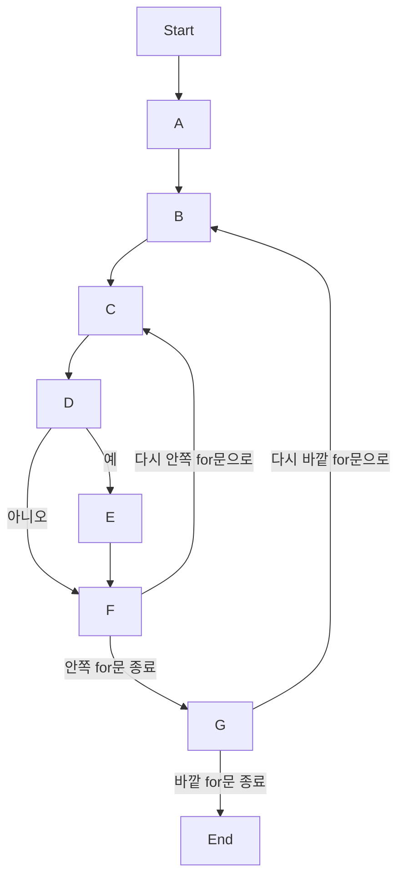

# 버블 정렬 과정
## 입력 데이터
``` yaml
John: 130, Sarah: 140, Emma: 120, Michael: 150, Emily: 135
```
## 시퀀스 다이어그램(딕셔너리 버블정렬)
* Start[시작]
    1. A[items 리스트 초기화: 딕셔너리 data에서 items로 변환]
    2. B{바깥 for문: i=0부터 len(items)-1}
    3. C{안쪽 for문: j=0부터 len(items)-1-i}
    4. D{items[j][1] > items[j+1][1] 확인}
    5. E[items[j]와 items[j+1] 위치 교환 (Swap)]
    6. F[j 증가하여 다음 원소 비교]
    7. G[i 증가]
* End[종료 및 items 출력]
    


### 코드 순서도

```mermaid
graph TD
    Start(Start)
    A[Convert Dictionary to List of Tuples]
    B[Set i to 0]
    C{Is i < len(items) - 1?}
    D[Set j to 0]
    E{Is j < len(items) - 1 - i?}
    F{items[j][1] > items[j + 1][1]?}
    G[Swap items[j] and items[j + 1]]
    H[Increment j by 1]
    I[Increment i by 1]
    End[Convert List of Tuples back to Dictionary]
    
    Start --> A
    A --> B
    B --> C
    C --> D
    D --> E
    E --> F
    F --> G
    G --> H
    H --> E
    E -- No --> I
    I --> C
    C -- No --> End
```
